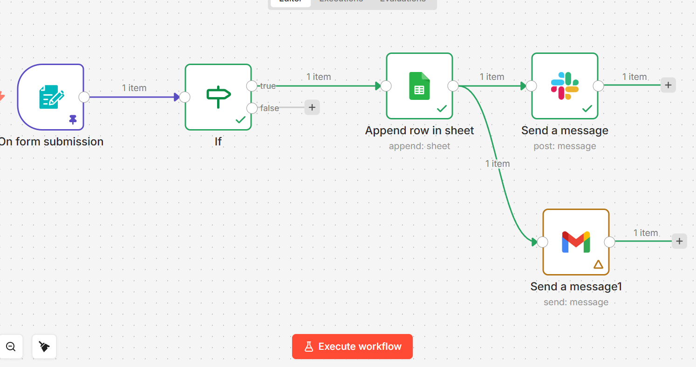

# Automated Course Registration & Notification System (n8n)

Automated course registration workflow built with n8n. Collects user data via form, filters submissions, stores responses in Google Sheets, and sends real-time notifications through Slack and Gmail.

## 📸 Workflow Screenshot

